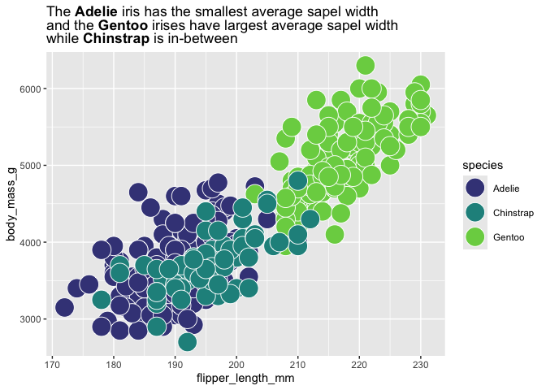

  - [Part 000. Abstract](#part-000-abstract)
  - [Part 00. Proposal](#part-00-proposal)
  - [Part 0. Lay out package
    infrastructure](#part-0-lay-out-package-infrastructure)
  - [Part 00 Explore ggplot object
    internals](#part-00-explore-ggplot-object-internals)
      - [grab fill color and associated group with
        `layer_data`](#grab-fill-color-and-associated-group-with-layer_data)
      - [grab the name of the variable that’s mapped to
        fill](#grab-the-name-of-the-variable-thats-mapped-to-fill)
      - [grab the categories in the mapped
        variable](#grab-the-categories-in-the-mapped-variable)
      - [create a color-category
        crosswalk](#create-a-color-category-crosswalk)
  - [Part I. Work out functionality 🚧
    ✅](#part-i-work-out-functionality--)
      - [A first cut at find-replace to add html color tags
        automatically to a
        string](#a-first-cut-at-find-replace-to-add-html-color-tags-automatically-to-a-string)
      - [Try out constituent functions w/ a fresh
        plot](#try-out-constituent-functions-w-a-fresh-plot)
  - [Further bundling](#further-bundling)
  - [Issues/Notes:](#issuesnotes)
  - [Part II. Packaging and
    documentation](#part-ii-packaging-and-documentation)
      - [Phase 1. Minimal working package
        ✅](#phase-1-minimal-working-package-)
  - [Bit 8: Compile readme](#bit-8-compile-readme)
  - [Bit 9: Push to github](#bit-9-push-to-github)
  - [Bit 10: listen and iterate](#bit-10-listen-and-iterate)
      - [Phase 3: Settling and testing
        🚧](#phase-3-settling-and-testing-)
      - [Phase 4. Promote to wider audience…
        🚧](#phase-4-promote-to-wider-audience-)
      - [Phase 5: Harden/commit: Submit to CRAN/RUniverse
        🚧](#phase-5-hardencommit-submit-to-cranruniverse-)
  - [Appendix: Reports, Environment](#appendix-reports-environment)
      - [Description file complete? 🚧](#description-file-complete-)
      - [Environment 🚧](#environment-)
      - [`devtools::check()` report](#devtoolscheck-report)
      - [Package directory file tree](#package-directory-file-tree)

# Part 000. Abstract

ggplot2 users sometimes forego a color or fill legend, instead coloring
the text of categories in a title or annotation as they make mention of
them using ggtext.

But the process for doing this, I believer, can be somewhat tedious and
error prone, because you have to type your own html color tags. The
color tags also might make source composed title text less readable.

I admire these plots, but maybe have made them once because they require
some stamina and focus to choreograph the colored text coordination.

Below we ‘crack open ggplot2 internals’ to try to streamline this
process. Our objective is that text coloring automatically matches
whatever ggplot2 is doing with color and fill scales.

# Part 00. Proposal

This repo proposes the {ggtextExtra} package. 🦄
<!-- (typical package introduction write up; but actually aspirational) -->

The goal of {ggtextExtra} is to make matching colors text written via
ggtext moves to ggplot2 layers (geoms that are filled or colored).

There’s just one function that’s worked out so far (matching fill color
for title), but I think it’s a useful one and could be easily extended
to other areas (geom\_textbox, color).

Without the package, we can do something like the following 🏋:

``` r
library(tidyverse)
#> ── Attaching core tidyverse packages ─────────────────── tidyverse 2.0.0.9000 ──
#> ✔ dplyr     1.1.0          ✔ readr     2.1.4     
#> ✔ forcats   1.0.0          ✔ stringr   1.5.0     
#> ✔ ggplot2   3.4.4.9000     ✔ tibble    3.2.1     
#> ✔ lubridate 1.9.2          ✔ tidyr     1.3.0     
#> ✔ purrr     1.0.1          
#> ── Conflicts ────────────────────────────────────────── tidyverse_conflicts() ──
#> ✖ dplyr::filter() masks stats::filter()
#> ✖ dplyr::lag()    masks stats::lag()
#> ℹ Use the conflicted package (<http://conflicted.r-lib.org/>) to force all conflicts to become errors

palmerpenguins::penguins  |>
 ggplot(aes(flipper_length_mm, body_mass_g,
             fill = species)) +
  geom_point(size = 7, alpha = .8, shape = 21, color = "white") +
  scale_fill_manual(values = c("plum4", "seagreen", "cadetblue")) +
  labs(title = "<span style = 'color: cadetblue;'>Gentoo</span> are our big penguins") +
  theme(plot.title = ggtext::element_markdown())
#> Warning: Removed 2 rows containing missing values or values outside the scale range
#> (`geom_point()`).
```

<!-- -->

An approach that automates the coordination a bit more can be found
here. <https://albert-rapp.de/posts/16_html_css_for_r/16_html_css_for_r>

But this requires a bit more typing and text in the html tags which
might make the readability of the title even more challenging.

-----

With the {ggtextExtra} package, we’ll live in a different world (🦄 🦄 🦄)
where the task a little more automatic:

Proposed API will:

1.  Build a ggplot in the usual way. I.e. do whatever you like with
    color/fill mapping to categories
2.  apply a function to that automatically checks the colors used to
    represent categories and applies those in the title where the
    categories appear. (via ggtext::element\_markdown).

What that would look like in code:

<!-- The following is fenced off to quote the code, but won't execute.  -->

``` 
my_title <- "The **setosa** irises has the largest average sapel widths <br>and then comes **virginica** irises while<br>**versicolor** has the shortest sapel width"

palmerpenguins::penguins  |>
 ggplot(aes(flipper_length_mm, body_mass_g,
             fill = species)) +
  geom_point(shape = 21, 
             color = "white", size = 8, alpha = .9) +
  scale_fill_viridis_d(end = .8, begin = .2) +
  labs(title = my_title) +
  theme(plot.title = ggtext::element_markdown())
  
use_fill_scale_in_title_words(plot = last_plot()) + 
  guides(fill = "none")  
```

# Part 0. Lay out package infrastructure

``` r
devtools::create(".")
```

# Part 00 Explore ggplot object internals

Now let’s ‘crack into ggplot2 internals’ to see if we can get to a match
between categories and colors programmatically.

First, we’ll look at the colors actually rendered in the layer data of
the plot using `layer_data`. These are often (always?) stored as hex
colors which will definitely work in html/markdown context, whereas you
have to be a little careful with some R named colors not working at all
in html.

## grab fill color and associated group with `layer_data`

First, we’ll use `layer_data` to grab fill and group.

``` r
plot <- last_plot()

fill_values_df <- layer_data(plot, i = 1) %>%  .[,c("fill", "group")] |> distinct()
fill_values_df
#>        fill group
#> 1     plum4     1
#> 2 cadetblue     3
#> 3  seagreen     2
```

## grab the name of the variable that’s mapped to fill

Then we’ll grab the name of the variable that’s mapped to fill. This
seems a little weird, but seems to works. Open to different approaches
that might be more robust\!

``` r
fill_var_name <- plot$mapping$fill |> capture.output() %>% .[2] %>% str_extract("\\^.+") %>% str_remove("\\^")
fill_var_name
#> [1] "species"
```

## grab the categories in the mapped variable

Then we can grab the actual vector of data that’s being represented by
fill color - the `plot$data` slot. We put this in a dataframe/tibble,
and then used `distinct` to get a one-to-one category-group table.

``` r
fill_var_df <- plot$data[fill_var_name] %>% distinct()
fill_var_df
#> # A tibble: 3 × 1
#>   species  
#>   <fct>    
#> 1 Adelie   
#> 2 Gentoo   
#> 3 Chinstrap
names(fill_var_df) <- "fill_var"
fill_var_df <- mutate(fill_var_df, group = as.numeric(fill_var))
fill_var_df
#> # A tibble: 3 × 2
#>   fill_var  group
#>   <fct>     <dbl>
#> 1 Adelie        1
#> 2 Gentoo        3
#> 3 Chinstrap     2
```

## create a color-category crosswalk

Then we join our colors and categories by group, and have a
color-category one-to-one table. And then we can prepare an html
statement that will make the category colorful when rendered by ggtext
functionality.

``` r
left_join(fill_values_df, fill_var_df, by = join_by(group)) %>% 
  mutate(html_replacements = 
           paste0("<span style = 'color: ", fill, 
                         "'>", fill_var, "</span>") )
#>        fill group  fill_var                                html_replacements
#> 1     plum4     1    Adelie       <span style = 'color: plum4'>Adelie</span>
#> 2 cadetblue     3    Gentoo   <span style = 'color: cadetblue'>Gentoo</span>
#> 3  seagreen     2 Chinstrap <span style = 'color: seagreen'>Chinstrap</span>
```

# Part I. Work out functionality 🚧 ✅

The above looks pretty promising so let’s put this in a function. The
function will let us go straight from a *ggplot2 plot object* to a
*category-color-htmlreplcement data frame*.

``` r
grab_fill_info <- function(plot = last_plot(), i = 1){
  
fill_values_df <- ggplot2::layer_data(plot, i = i) %>%  
  .[,c("fill", "group")] |> 
  dplyr::distinct()

fill_var_name <- plot$mapping$fill |> 
  capture.output() %>% .[2] %>% 
  stringr::str_extract("\\^.+") %>% 
  stringr::str_remove("\\^")

fill_var_df <- plot$data[,fill_var_name] |> 
  dplyr::distinct()

names(fill_var_df) <- "fill_var"

fill_var_df <- fill_var_df |> mutate(group = as.numeric(fill_var))


dplyr::left_join(fill_values_df, 
                 fill_var_df, 
                 by = dplyr::join_by(group)) %>% 
  dplyr::mutate(html_replacements = 
                  paste0("<span style = 'color: ", 
                         .data$fill, 
                         "'>", 
                         .data$fill_var, 
                         "</span></strong>") )
  
}
```

We can test this out with the plot we saved before:

``` r
grab_fill_info(plot = plot)
#>        fill group  fill_var
#> 1     plum4     1    Adelie
#> 2 cadetblue     3    Gentoo
#> 3  seagreen     2 Chinstrap
#>                                           html_replacements
#> 1       <span style = 'color: plum4'>Adelie</span></strong>
#> 2   <span style = 'color: cadetblue'>Gentoo</span></strong>
#> 3 <span style = 'color: seagreen'>Chinstrap</span></strong>
```

## A first cut at find-replace to add html color tags automatically to a string

And then we’ll use the data frame output, to make replacements in a
string, adding the html tags. We’ll just get it done with a for loop.
One danger, that I’m leaving for later, is that you might have a
categories like ‘anana’ (this means pineapple in Portuguese and maybe
some other languages) and ‘banana’ (this means banana in Portuguese and
maybe some other languages). In this case, you’ll have a bad result
given the current implementation. (Anana has an acent on the final
syllable in Portuguese you might actually be saved\!) male/female is the
same problem - but not as nice of a tangent.

``` r
fill_df <- grab_fill_info(plot)

for(i in 1:nrow(fill_df)){

  start <- "Gentoo have the longest average flippers"
  
  start <- start |> stringr::str_replace(fill_df$fill_var[i] %>% as.character(), fill_df$html_replacements[i])

start %>% print()
  
}
#> [1] "Gentoo have the longest average flippers"
#> [1] "<span style = 'color: cadetblue'>Gentoo</span></strong> have the longest average flippers"
#> [1] "Gentoo have the longest average flippers"
```

Let’s put the for loop in a function:

``` r
auto_color_html <- function(x, fill_df ){
  
 for(i in 1:nrow(fill_df)){

  x <- x |> stringr::str_replace(fill_df$fill_var[i] %>% as.character, fill_df$html_replacements[i])
  
 }
  
  x
  
}
```

Test it out…

``` r
auto_color_html("The Gentoo is a cool penguin", grab_fill_info(plot))
#> [1] "The <span style = 'color: cadetblue'>Gentoo</span></strong> is a cool penguin"
```

## Try out constituent functions w/ a fresh plot

Now let’s use our functions with a fresh plot, q.

``` r
palmerpenguins::penguins  |>
 ggplot(aes(flipper_length_mm, body_mass_g,
             fill = species)) +
  geom_point(shape = 21, color = "white", size = 8) +
  scale_fill_viridis_d(end = .8, begin = .2) +
  labs(title = "The **Adelie** iris has the smallest average sapel width<br>and the **Gentoo** irises have largest average sapel width<br>
       while **Chinstrap** is in-between") +
  theme(plot.title = ggtext::element_markdown())
#> Warning: Removed 2 rows containing missing values or values outside the scale range
#> (`geom_point()`).
```

<!-- -->

``` r

q <- last_plot()

q_fill_df <- grab_fill_info(q)

colorful_title <- "The **Adelie** penguin has the *smallest* average flipper length<br>and the **Gentoo** have *largest* length<br> while **Chinstrap** species is in-between" |> 
        auto_color_html(q_fill_df)

q + 
  labs(title = colorful_title)  #overwriting title
#> Warning: Removed 2 rows containing missing values or values outside the scale range
#> (`geom_point()`).
```

<!-- -->

# Further bundling

Looks good. What if we wrap everything, and just replace the title with
an html color-tagged version.

``` r
use_fill_scale_in_title_words <- function(plot, i = 1){
  
  out <- plot
  plot_fill_df <- grab_fill_info(plot, i = i)
  
  out$labels$title <- out$labels$title |> 
        auto_color_html(plot_fill_df)

  return(out)
  
}
```

Try it out starting fresh.

``` r
my_title <- "The **Adelie** penguin has the *smallest* average flipper length<br>and the **Gentoo** have *largest* length<br> while **Chinstrap** species is in-between" 

palmerpenguins::penguins |>
 ggplot() +
  aes(x = flipper_length_mm, 
      y = body_mass_g,
      fill = species) +
  geom_point(shape = 21, 
             color = "white", size = 8, alpha = .9) +
  scale_fill_viridis_d(end = .8, begin = .2) +
  labs(title = my_title) +
  theme(plot.title = ggtext::element_markdown())
#> Warning: Removed 2 rows containing missing values or values outside the scale range
#> (`geom_point()`).
```

<!-- -->

``` r

use_fill_scale_in_title_words(plot = last_plot()) + 
  guides(fill = "none")
#> Warning: Removed 2 rows containing missing values or values outside the scale range
#> (`geom_point()`).
```

<!-- -->

# Issues/Notes:

  - fill mapping should be globally declared
  - data should be globally declared
  - fill colors are taken from the 1st layer unless i is changed.
  - naive string replacement issue

# Part II. Packaging and documentation

## Phase 1. Minimal working package ✅

To build a minimal working package, 1) we’ll need to document
dependencies 2) send functions to .R files in the R folder, 3) do a
package check (this will A. Document our functions and B. this will help
us identify problems - for example if we’ve failed to declare a
dependency) and 4) install the package locally.

Then we’ll write up a quick advertisement for what our package is able
to do in the ‘traditional readme’ section. This gives us a chance to
test out the package.

``` r
### Bit 2a: in the function(s) you wrote above make sure dependencies to functions using '::' syntax to pkg functions 
usethis::use_package("ggplot2") # Bit 2b: document dependencies, w hypothetical ggplot2
usethis::use_package("dplyr")
usethis::use_package("stringr")
usethis::use_package("tibble")
usethis::use_pipe()
```

``` r
knitrExtra::chunk_names_get()
#> It seems you are currently knitting a Rmd/Qmd file. The parsing of the file will be done in a new R session.
#>  [1] "unnamed-chunk-1"               "unnamed-chunk-2"              
#>  [3] "unnamed-chunk-3"               "unnamed-chunk-4"              
#>  [5] "unnamed-chunk-5"               "unnamed-chunk-6"              
#>  [7] "unnamed-chunk-7"               "grab_fill_info"               
#>  [9] "unnamed-chunk-8"               "unnamed-chunk-9"              
#> [11] "auto_color_html"               "unnamed-chunk-10"             
#> [13] "unnamed-chunk-11"              "use_fill_scale_in_title_words"
#> [15] "unnamed-chunk-12"              "unnamed-chunk-13"             
#> [17] "unnamed-chunk-14"              "unnamed-chunk-15"             
#> [19] "unnamed-chunk-16"              "unnamed-chunk-17"             
#> [21] "unnamed-chunk-18"              "test_calc_times_two_works"    
#> [23] "unnamed-chunk-19"              "unnamed-chunk-20"             
#> [25] "unnamed-chunk-21"              "unnamed-chunk-22"             
#> [27] "unnamed-chunk-23"              "unnamed-chunk-24"
# Bit 3: send the code chunk with function to R folder
knitrExtra:::chunk_to_r(chunk_name = "grab_fill_info") 
#> It seems you are currently knitting a Rmd/Qmd file. The parsing of the file will be done in a new R session.
knitrExtra:::chunk_to_r(chunk_name = "auto_color_html")
#> It seems you are currently knitting a Rmd/Qmd file. The parsing of the file will be done in a new R session.
knitrExtra:::chunk_to_r(chunk_name = "use_fill_scale_in_title_words")
#> It seems you are currently knitting a Rmd/Qmd file. The parsing of the file will be done in a new R session.
```

``` r
# Bit 4: document functions and check that package is minimally viable
devtools::check(pkg = ".")  

# Bit 5: install package locally
devtools::install(pkg = ".", upgrade = "never") 
```

### Bit 7. Write traditional README that uses built package (also serves as a test of build). ✅

The goal of the {ggtextExtra} package is to …

Install package with:

    remotes::install_github("EvaMaeRey/ggtextExtra")

Once functions are exported you can remove go to two colons, and when
things are are really finalized, then go without colons (and rearrange
your readme…)

``` r
library(ggtextExtra)
my_title <- "The **Adelie** penguin has the *smallest* average flipper length<br>and the **Gentoo** have *largest* length<br> while **Chinstrap** species is in-between"

palmerpenguins::penguins |>
 ggplot() +
  aes(x = flipper_length_mm, 
      y = body_mass_g,
      fill = species) +
  geom_point(shape = 21, 
             color = "white", size = 8, alpha = .9) +
  scale_fill_viridis_d(end = .8, begin = .2) +
  labs(title = my_title) +
  theme(plot.title = ggtext::element_markdown())
#> Warning: Removed 2 rows containing missing values or values outside the scale range
#> (`geom_point()`).
```

<!-- -->

``` r

ggtextExtra:::use_fill_scale_in_title_words(plot = last_plot()) + 
  guides(fill = "none")
#> Warning: Removed 2 rows containing missing values or values outside the scale range
#> (`geom_point()`).
```

<!-- -->

# Bit 8: Compile readme

# Bit 9: Push to github

# Bit 10: listen and iterate

## Phase 3: Settling and testing 🚧

### Bit A. Added a description and author information in the [DESCRIPTION file](https://r-pkgs.org/description.html) 🚧

### Bit B. Added [roxygen skeleton](https://r-pkgs.org/man.html) for exported functions. 🚧

### Bit D. Settle on [examples](https://r-pkgs.org/man.html#sec-man-examples). Put them in the roxygen skeleton and readme. 🚧

### Bit C. Chosen a [license](https://r-pkgs.org/license.html)? 🚧

``` r
usethis::use_mit_license()
```

### Bit D. Use life-cycle badge

``` r
usethis::use_lifecycle_badge("experimental") 
```

### Bit E. Written formal [tests](https://r-pkgs.org/testing-basics.html) of functions and save to test that folders 🚧

That would look like this…

``` r
library(testthat)

test_that("calc times 2 works", {
  expect_equal(times_two(4), 8)
  expect_equal(times_two(5), 10)
  
})
```

``` r
knitrExtra::chunk_to_tests_testthat("test_calc_times_two_works")
```

### Bit F. Check again. Addressed notes, warnings and errors. 🚧

``` r
devtools::check(pkg = ".")
```

## Phase 4. Promote to wider audience… 🚧

### Bit A. Package website built? 🚧

### Bit B. Package website deployed? 🚧

## Phase 5: Harden/commit: Submit to CRAN/RUniverse 🚧

# Appendix: Reports, Environment

## Description file complete? 🚧

``` r
readLines("DESCRIPTION")
```

## Environment 🚧

Here I just want to print the packages and the versions

``` r
all <- sessionInfo() |> print() |> capture.output()
all[11:17]
#> [1] ""                                                                         
#> [2] "attached base packages:"                                                  
#> [3] "[1] stats     graphics  grDevices utils     datasets  methods   base     "
#> [4] ""                                                                         
#> [5] "other attached packages:"                                                 
#> [6] " [1] ggtextExtra_0.0.0.9000 lubridate_1.9.2        forcats_1.0.0         "
#> [7] " [4] stringr_1.5.0          dplyr_1.1.0            purrr_1.0.1           "
```

## `devtools::check()` report

``` r
devtools::check(pkg = ".")
```

## Package directory file tree

``` r
fs::dir_tree(recurse = T)
#> .
#> ├── DESCRIPTION
#> ├── NAMESPACE
#> ├── R
#> │   ├── auto_color_html.R
#> │   ├── grab_fill_info.R
#> │   ├── use_fill_scale_in_title_words.R
#> │   └── utils-pipe.R
#> ├── README.Rmd
#> ├── README.md
#> ├── README_files
#> │   └── figure-gfm
#> │       ├── unnamed-chunk-11-1.png
#> │       ├── unnamed-chunk-11-2.png
#> │       ├── unnamed-chunk-12-1.png
#> │       ├── unnamed-chunk-12-2.png
#> │       ├── unnamed-chunk-16-1.png
#> │       ├── unnamed-chunk-16-2.png
#> │       └── unnamed-chunk-2-1.png
#> ├── ggtextExtra.Rproj
#> ├── man
#> │   └── pipe.Rd
#> └── readme2pkg.template.Rproj
```
